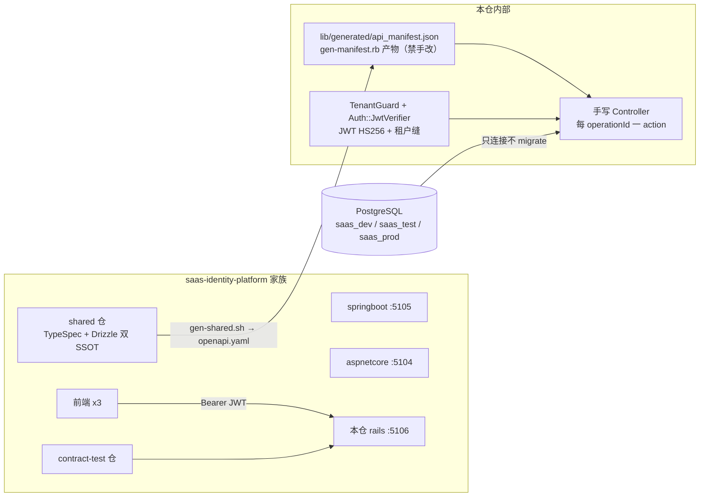

# saas-identity-platform-rails 架构

> 一句话定位：saas-identity-platform 家族的 Ruby 后端实现——同一份产品契约下的第三个真后端（与 aspnetcore / springboot 互为镜像），Rails 8.1 API 模式 + PostgreSQL，契约面 = shared OpenAPI 产物 + 手写 controller 逐 operationId 实现（route-parity 强制），被三个前端与 contract-test 黑盒消费。书稿配套：xr-know-012《Ruby从入门到项目实践》。

## 1. 总览

- **家族角色**：后端仓（X06 扩展槽位，:5106）。与 saas-identity-platform-aspnetcore / springboot 互为镜像实现，必须通过 contract-test 仓的黑盒校验，保证「前端不可区分」。
- **技术栈**（钉死 `version-lock.json`）：Ruby 3.4.10 + Rails 8.1.4 API 模式 + pg 1.5 + puma 6 + jwt 2.8（HS256）+ rack-cors + dotenv-rails；minitest（随 rails）+ rubocop ~>1.60（L1/L2 门）+ brakeman（L2.security 门）。
- **DB-First（ADR-0025）**：schema SSOT = shared 仓 drizzle；本仓 **禁 db/migrate**（`db/migrate/` 不存在，`maintain_test_schema = false`，家族镜像 springboot 禁 Flyway）。模型（Stage C 起）显式 `self.table_name`/`self.primary_key` 对齐 drizzle schema。
- **种子零**：种子数据归 shared 仓 seed-db.mjs 独占，本仓不产种子。
- **codegen**（profiles/codegen.md §1 rails 行）：openapi-generator 无成熟 Rails server 生成器 → 自研 `scripts/gen-manifest.rb` 读 shared `generated/openapi/openapi.yaml` → 产 `lib/generated/api_manifest.json`（确定性产物，committed）；`test/contracts/route_parity_test.rb` 读生成物断言「缺端点红 / 私端点红」——suite 硬规则 §4 在无编译语言上的等价强制。Stage C 落地。

## 2. 边界与契约

## 3. env 契约

- 三件套 `.env.example` / `.env.test` / `.env.production` 键集严格相等（L0.5 门），键名照抄 springboot 镜像；`.env.local`（gitignored）放本机 dev 真值（家族先例：lab 两后端）。
- 加载：dotenv-rails（dev/test 自动；`rake test` 时 RAILS_ENV=test → `.env.test`）。
- **两处相对 springboot 的有意偏离**：
  1. `SECRET_KEY_BASE`（rails 专属）：credentials.yml.enc/master.key 已删，prod 由 `config.secret_key_base = ENV.fetch(...)` fail-fast。
  2. `.env.test` 的 `PG_DATABASE=saas_test`（springboot 镜像值是 saas_dev）：springboot 靠 test profile 覆盖选库，rails 无 profile 机制、直连库由 env 决定；测试链=saas_test（家族三库分层 §6.2）。
- DATABASE_URL/DATABASE_NAME/DATABASE_USER/DATABASE_PASSWORD/JWT_AUTHORITY 五键是 deploy 脚本兼容键，rails 运行时只读 PG_* 五件套 + JWT 四键 + SERVER_PORT + SAAS_CORS_ALLOWED_ORIGINS + SECRET_KEY_BASE。

## 4. 测试与 trace

- `test/test_helper.rb`：RAILS_ENV=test → boot rails → 挂 harness（`test/harness/fn.rb` 登记 + `TRACE_MAP=1` 时 `Harness::TraceReporter`）；`parallelize(workers: TRACE_MAP ? 1 : :number_of_processors)`（多进程竞写 trace.json）。
- trace 产物契约 `{"schema":1,"tests":[{"test","fns","inert"}]}`；skip 测试双保险强制 fns=[]。
- `Rakefile` 用裸 Rake::TestTask（**非** rails test task）：rails 的 test 链会跑 db:prepare/schema 装载，违反 DB-First。
- request specs（Stage C）走 saas_test 真库链，fail-not-skip（ADR-0020）。

## 5. 关联

- 家族约定：`docs/conventions/multi-repo-family.md`（§6 端口表 X06 行、§6.2 三库分层）
- 加栈配方：`profiles/rails.toml` + `adapters/rails/` + `profiles/codegen.md` §1
- 镜像参照：`output/saas-identity-platform-springboot/ARCHITECTURE.md`
